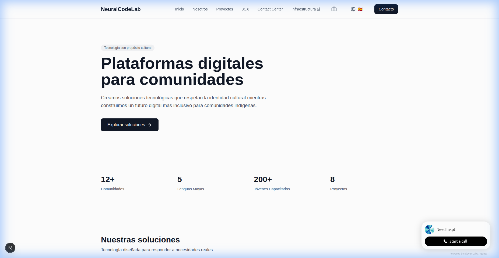
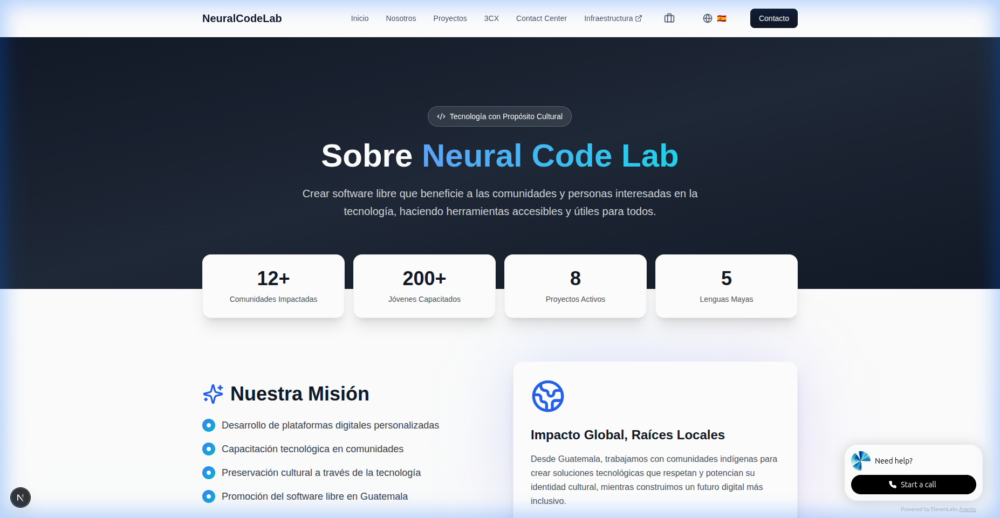
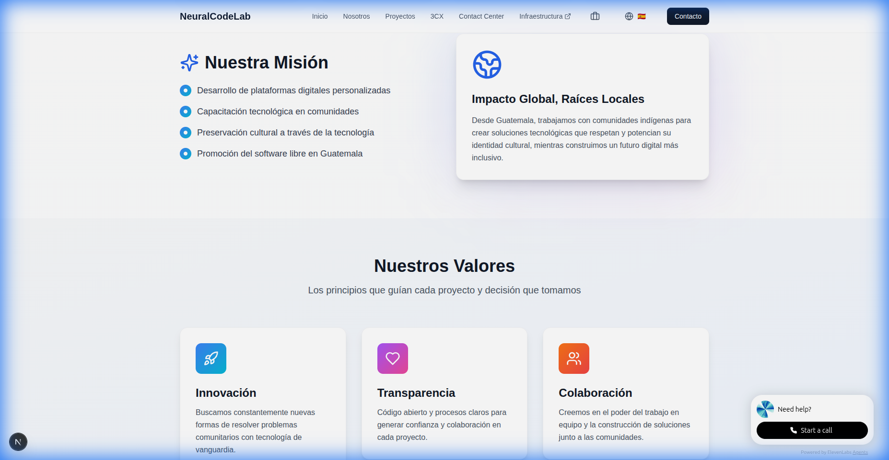
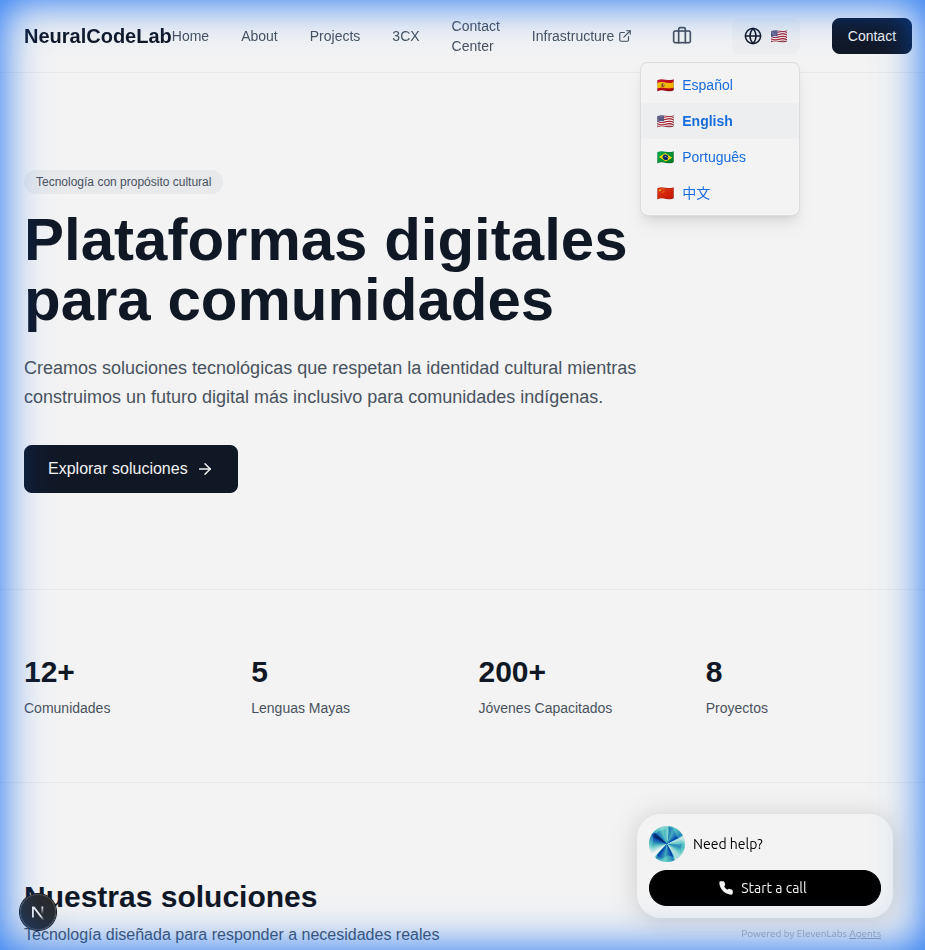
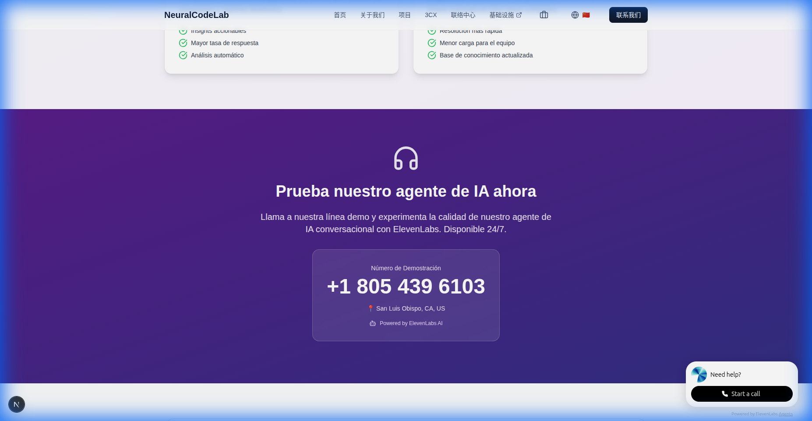

<div align="center">

# 🧠 Neural Code Lab

### Tecnología con Propósito Cultural

[](https://neuralcodelab.com)
[](https://nextjs.org/)
[](https://reactjs.org/)
[](https://www.typescriptlang.org/)
[](https://tailwindcss.com/)

**Plataformas digitales personalizadas con arquitecturas adaptadas a necesidades comunitarias**

[🌐 Visitar Sitio](https://neuralcodelab.com) • [📧 Contacto](mailto:devlewiso@gmail.com) • [💼 LinkedIn](https://www.linkedin.com/in/devlewiso)

</div>

---

## 📋 Tabla de Contenidos

- [Acerca del Proyecto](#-acerca-del-proyecto)
- [Características Principales](#-características-principales)
- [Capturas de Pantalla](#-capturas-de-pantalla)
- [Tecnologías](#-tecnologías)
- [Soporte Multi-Idioma](#-soporte-multi-idioma)
- [Integraciones](#-integraciones)
- [Contacto](#-contacto)

---

## 🎯 Acerca del Proyecto

**Neural Code Lab** es una organización dedicada a crear software libre que beneficie a las comunidades y personas interesadas en la tecnología. Trabajamos para hacer herramientas accesibles y útiles para todos, con un enfoque especial en:

- 🌍 **Desarrollo de plataformas digitales personalizadas**
- 👥 **Capacitación tecnológica en comunidades**
- 🏛️ **Preservación cultural a través de la tecnología**
- 🔓 **Promoción del software libre en Guatemala**

### 📊 Impacto

<div align="center">

| 🏘️ Comunidades | 👨‍🎓 Jóvenes Capacitados | 🚀 Proyectos Activos | 🗣️ Lenguas Mayas |
|:---:|:---:|:---:|:---:|
| **12+** | **200+** | **8** | **5** |

</div>

---

## ✨ Características Principales

### 🌐 Multi-Idioma
- **4 idiomas soportados**: Español, English, Português, 中文
- Detección automática del idioma del navegador
- Selector manual de idioma con persistencia en localStorage
- Traducciones completas de la interfaz

### 🤖 Agente de IA Conversacional
- Integración con **ElevenLabs ConvAI**
- Atención telefónica 24/7 con IA
- Número demo: **+1 805 439 6103** (San Luis Obispo, CA)
- Soporte multi-idioma en conversaciones

### 📞 Soluciones de Comunicación
- **3CX Phone System** - Telefonía empresarial moderna
- **Contact Center AI** - Centro de contacto potenciado con IA
- Integración con N8N para automatizaciones
- Análisis de sentimientos y transcripciones en tiempo real

### 🎨 Diseño Moderno
- Interfaz limpia y profesional
- Gradientes y animaciones suaves
- Diseño responsive para todos los dispositivos
- Componentes reutilizables con Tailwind CSS

---

## 📸 Capturas de Pantalla

### 🏠 Página de Inicio
<div align="center">
  
  <p><em>Página principal con hero section y características destacadas</em></p>
</div>

### 👥 Sobre Nosotros
<div align="center">
  
  <p><em>Sección hero con estadísticas de impacto</em></p>
</div>

<div align="center">
  
  <p><em>Misión y valores de Neural Code Lab</em></p>
</div>

### 🌍 Selector de Idiomas
<div align="center">
  
  <p><em>Selector de idioma con 4 opciones: Español, English, Português, 中文</em></p>
</div>

### 📞 Centro de Contacto con IA
<div align="center">
  
  <p><em>Número demo con integración de ElevenLabs AI</em></p>
</div>

---

## 🛠️ Tecnologías

### Frontend
- **[Next.js 15.5.9](https://nextjs.org/)** - Framework React con App Router
- **[React 18](https://reactjs.org/)** - Biblioteca de UI
- **[TypeScript](https://www.typescriptlang.org/)** - Tipado estático
- **[Tailwind CSS](https://tailwindcss.com/)** - Framework CSS utility-first

### UI/UX
- **[Lucide React](https://lucide.dev/)** - Iconos modernos
- **[Next/Image](https://nextjs.org/docs/api-reference/next/image)** - Optimización de imágenes
- **[Next/Font](https://nextjs.org/docs/basic-features/font-optimization)** - Optimización de fuentes

### Integraciones
- **[ElevenLabs ConvAI](https://elevenlabs.io/)** - Agente de IA conversacional
- **[Google Analytics](https://analytics.google.com/)** - Analítica web
- **[3CX](https://www.3cx.com/)** - Sistema telefónico
- **[N8N](https://n8n.io/)** - Automatización de workflows

### Infraestructura
- **[Vercel](https://vercel.com/)** - Hosting y despliegue
- **CDN** - Distribución de contenido global
- **SSL/TLS** - Seguridad de conexiones

---

## 🌍 Soporte Multi-Idioma

El sitio soporta 4 idiomas con detección automática y cambio manual:

### Idiomas Soportados

| Idioma | Código | Flag | Estado |
|--------|--------|------|--------|
| Español | `es` | 🇪🇸 | ✅ Completo |
| English | `en` | 🇺🇸 | ✅ Completo |
| Português | `pt` | 🇧🇷 | ✅ Completo |
| 中文 | `zh` | 🇨🇳 | ✅ Completo |

### Implementación

```typescript
// Uso del hook de traducción
import { useTranslation } from '@/lib/useTranslation';

function Component() {
  const { t, language, setLanguage } = useTranslation();
  
  return <h1>{t('header.home')}</h1>;
}
```

Las traducciones se almacenan en `public/translations.json` con la siguiente estructura:

```json
{
  "es": {
    "header": {
      "home": "Inicio",
      "about": "Nosotros"
    }
  },
  "en": {
    "header": {
      "home": "Home",
      "about": "About"
    }
  }
}
```

---

## 🔌 Integraciones

### ElevenLabs ConvAI Widget

```html
<elevenlabs-convai agent-id="your-agent-id"></elevenlabs-convai>
```

### Google Analytics

```javascript
gtag('config', 'G-L2S3KDPQ94');
```

### 3CX Phone System

- Número principal: **+1 567 406 1261** (Whitehouse, OH)
- Número demo: **+1 805 439 6103** (San Luis Obispo, CA)

---

## 📞 Contacto

**Iran Lewis** - Founder & Developer

- 🌐 Website: [neuralcodelab.com](https://neuralcodelab.com)
- 💼 LinkedIn: [@devlewiso](https://www.linkedin.com/in/devlewiso)
- 🐙 GitHub: [@devlewiso](https://github.com/devlewiso)
- 📧 Email: devlewiso@gmail.com
- 📞 Demo Line: +1 805 439 6103

---

<div align="center">

### 🌟 Si te gusta este proyecto, ¡dale una estrella! ⭐

**Hecho con ❤️ en Guatemala 🇬🇹**

*Impulsando el software libre y la tecnología accesible para todos*

</div>
